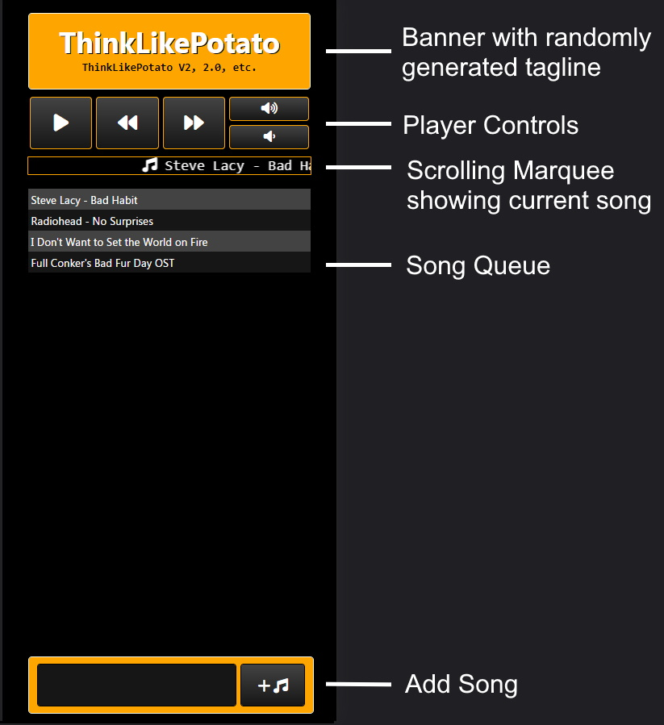

# thinkLikePotato
A Flask web server for controlling a youtube music player remotely.
The music outputs to a virtual audio cable that gets mixed in with my voice, which is used as my microphone input for voice chat programs.

This was my first time properly using JS and CSS, so i apologise for any sloppy/improper code or styling.

